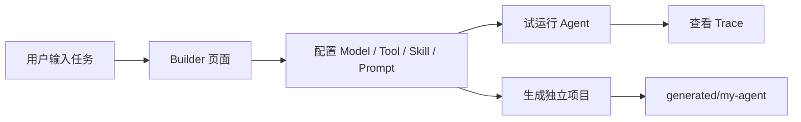
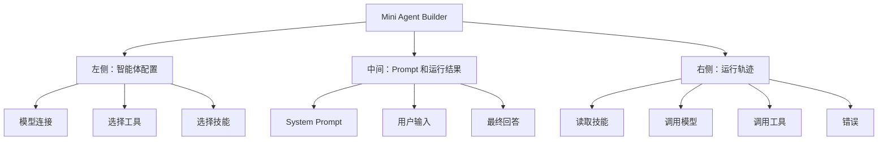
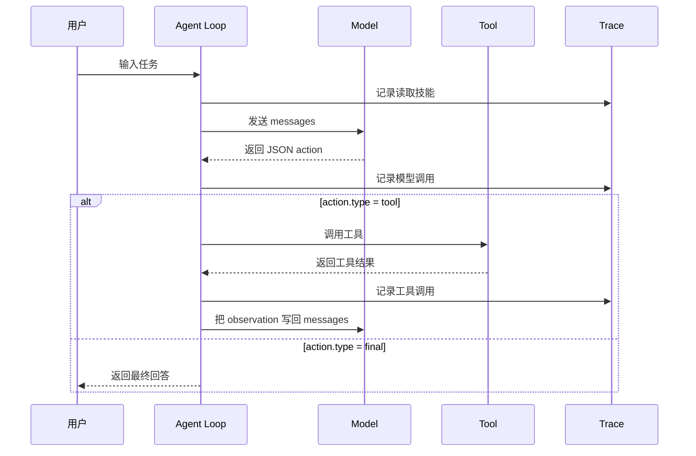
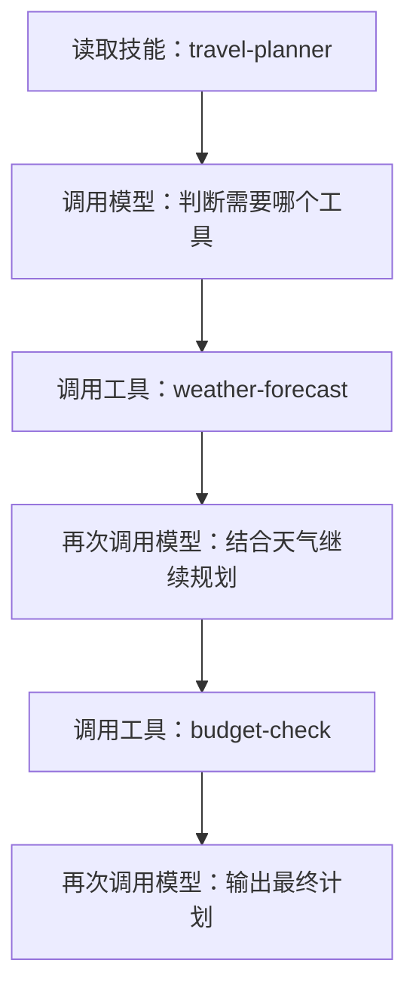
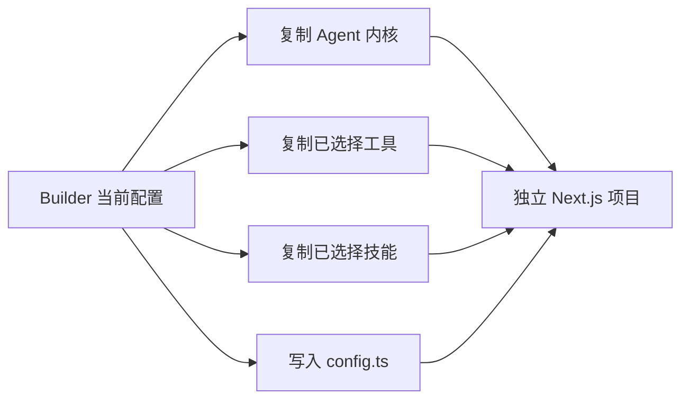
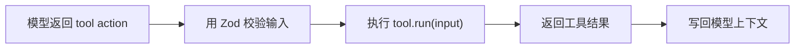
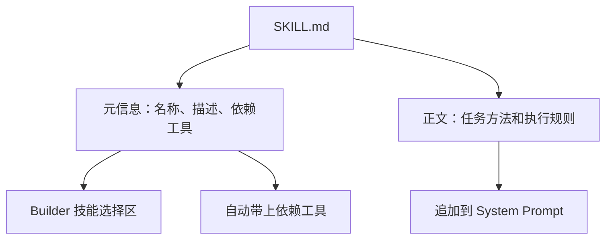

# mini-agent-builder

`mini-agent-builder` 是一个面向初学者的可视化 Agent 创建器。它不是复杂的 Agent 框架，而是一个可以边配置、边试跑、边观察执行过程的小型学习项目。

你可以用它完成三件事：

1. 在页面上配置一个 Agent。
2. 运行 Agent，并看到每一步 Trace。
3. 一键生成一个可以独立运行的 Next.js Agent 项目。

## 先看一张图



这张图就是项目的核心：页面不是为了做一个大平台，而是帮助你把 Agent 的几个基础部件看清楚。

## 页面里有什么



初学者可以把它理解成一个透明的 Agent 实验台：

- 左侧决定 Agent 拥有什么能力。
- 中间决定 Agent 要怎么思考、要处理什么任务。
- 右侧展示 Agent 实际运行时发生了什么。

## Agent 到底在循环什么

Agent 的核心不是“会聊天”，而是一个循环：



这个项目故意把 Agent 拆成几个最小概念：

| 概念 | 在项目里是什么意思 |
| --- | --- |
| Model | OpenAI-compatible 模型接口，负责根据上下文决定下一步 |
| Tool | 可被 Agent 调用的函数，例如查天气、评估预算、生成行程 |
| Skill | 一份 `SKILL.md`，告诉 Agent 某类任务应该如何执行，也可以声明依赖工具 |
| Loop | 模型输出 action，Agent 解析 action，必要时调用工具，再把结果写回模型 |
| Trace | 把读取技能、调用模型、调用工具和错误记录下来，方便学习和调试 |

## 快速运行

先安装依赖：

```bash
npm install
```

启动 Builder：

```bash
npm run dev
```

打开：

```text
http://localhost:3000
```

页面默认是一个旅行计划 Agent 示例。你可以直接填写 API Key，然后点击“运行 Agent”。

## 第一次试跑建议

可以先用默认旅行示例：

```text
我周末从杭州去苏州，两个人，预算 1500 元，帮我做一个 2 天 1 晚的旅行计划。
```

运行后重点看右侧 Trace：



如果模型输出的 JSON 不符合协议，Trace 里会出现错误。这是故意保留的学习入口：你可以从错误里看到 Agent 为什么停下。

## 生成独立项目

配置确认后，点击页面上的“生成项目”。项目会写入：

```text
generated/<project-slug>/
```

生成后的项目不依赖 Builder，可以单独运行：

```bash
cd generated/<project-slug>
npm install
npm run dev
```

生成关系如下：



## 如何新增工具

工具是 Agent 可以调用的函数。每个工具包含：

- `name`
- `description`
- `schema`
- `run(input)`

示意图：



工具文件放在：

```text
apps/builder/src/tools/<tool-id>.ts
```

当前内置的教学工具：

| 工具 | 用途 |
| --- | --- |
| `calculator` | 计算四则运算表达式 |
| `current-time` | 返回当前运行时间 |
| `weather-forecast` | 使用 Open-Meteo 免费接口查询天气，不需要 API Key |
| `budget-check` | 根据费用项目评估预算是否足够 |
| `itinerary-planner` | 根据目的地、天数、天气和预算生成行程 |

## 如何新增技能

技能不是一段写死在代码里的描述，而是一个目录：

```text
apps/builder/src/skills/<skill-id>/
  SKILL.md
```

`SKILL.md` 由两部分组成：

```md
---
id: travel-planner
name: 旅行计划
description: 把旅行需求拆成天气查询、预算评估和行程安排
tools:
  - weather-forecast
  - budget-check
  - itinerary-planner
---

# 旅行计划

当用户提出旅行计划需求时，先确认目的地、天数、人数和预算。
优先查询天气，再评估预算，最后输出按天拆分的行程。
```

技能的作用可以这样理解：



别人下载一个包含 `SKILL.md` 的技能目录后，只要放进 `apps/builder/src/skills/`，Builder 就会读取并展示。

## 当前版本包含什么

已包含：

- OpenAI-compatible 模型配置
- System Prompt 编辑器
- 工具选择
- 技能选择
- 页面试跑 Agent
- Trace 可视化
- 可调宽度的配置栏和轨迹栏
- 一键生成独立 Next.js Agent 项目

暂不包含：

- 登录系统
- 云端部署
- RAG
- 长期记忆
- 多 Agent 协作
- 插件市场
- 复杂权限系统
- 机票、火车票、酒店或景点实时查询

## 适合怎么学习

建议按这个顺序看代码：

```text
1. apps/builder/src/agent/trace.ts
2. apps/builder/src/agent/tool.ts
3. apps/builder/src/agent/skill.ts
4. apps/builder/src/agent/protocol.ts
5. apps/builder/src/agent/agent.ts
6. apps/builder/app/page.tsx
```

先看类型，再看循环，最后看页面。这样更容易理解 Agent 不是一个神秘概念，而是一段可观察、可调试的程序流程。
